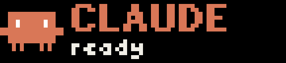
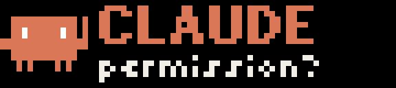

<p align="center">
  
</p>

<h1 align="center">busybar-agents</h1>

<p align="center">
  Coding agents raise a hand on your <a href="https://busy.app">BUSY Bar</a> when they need you.
</p>

<p align="center">
  <a href="https://github.com/davidkh1/busybar-agents/actions/workflows/ci.yml"></a>
  
  
  
</p>

Claude Code asks for permission, or waits for your answer, and the bar on your
desk shows Clawd, the Claude Code mascot, with an arm up. Its LEDs blink. You reply and the arm comes
down. The turn ends and Clawd looks happy. Turn the wheel, and the tool call
is approved without touching the keyboard.

## What you see

| | |
| --- | --- |
|  | **Session starts.** Clawd says hello for `BUSYBAR_HELLO_SECONDS`. |
|  | **Needs you.** A permission prompt. Arm up, orange LEDs. |
|  | **Your turn.** Claude finished and you have been away a minute. |
|  | **Done.** The turn ended, in the session named with `/rename`, or in that folder. Stays for `BUSYBAR_DONE_SECONDS`. |
|  | **Ask.** Wheel forward to allow, back to deny. Opt-in. |
|  | **Two sessions.** One strip, one queue. |
|  | **Your side.** The back OLED mirrors the front. |

Claude speaks in Claude orange, with Clawd drawn as a 16-pixel bitmap. Other
agents get a `>_` glyph in their own colour.

## Setup in a minute

```bash
# 1. Plug the bar in over USB. It answers at 10.0.4.20, no drivers.

# 2. Clone, and link the Claude Code plugin so it loads in every session.
git clone https://github.com/davidkh1/busybar-agents
ln -s "$PWD/busybar-agents/adapters/claude-code" ~/.claude/skills/busybar-agents

# 3. Open claude. Clawd says ready.
claude
```

The plugin runs the CLI from the clone through [uv](https://docs.astral.sh/uv/).
To have `busybar-agents` on your PATH as well:

```bash
uv tool install git+https://github.com/davidkh1/busybar-agents
busybar-agents status
```

To try it for one session only, skip the link and pass the plugin directly:
`claude --plugin-dir ./busybar-agents/adapters/claude-code`.

> Permission screens appear in the default permission mode. Auto mode never
> prompts, so there you get the ready blip, DONE, and "your turn".

## What Claude Code tells the bar

| Claude Code event | Bar |
| --- | --- |
| `SessionStart` | `CLAUDE / ready` for `BUSYBAR_HELLO_SECONDS` |
| `Notification` permission prompt | arm up, `CLAUDE / permission?` |
| `Notification` idle, subagent needs input, elicitation | arm up, `CLAUDE / your turn` or `input?` |
| `UserPromptSubmit`, `SessionEnd` | arm down |
| `Stop` | `DONE / session` for `BUSYBAR_DONE_SECONDS` |
| `PermissionRequest`, with `BUSYBAR_ASK=1` | `ALLOW? / Bash: npm test`, then your wheel decides |
| `PreToolUse` for `AskUserQuestion`, with `BUSYBAR_ASK=1` | one option at a time; the wheel scrolls, resting picks |
| `Stop` after a question, with `BUSYBAR_GO=1` | `GO? / wheel = yes`; wheel forward tells Claude to go ahead |

The second line names the session: the name you gave it with `/rename`, or
the folder you started `claude` in.

Hand up and hand down run in the background. Stop and SessionEnd run in the
foreground, because Claude Code exits right after them in print mode; each
takes about a quarter of a second.

## Talk back with the wheel

Three things Claude Code asks you can be answered from the bar, without a
keyboard. All three are off by default.

```bash
BUSYBAR_ASK=1 BUSYBAR_GO=1 claude
```

| Claude asks | Bar shows | You do |
| --- | --- | --- |
| permission for a tool call | `ALLOW? / Bash: npm test` | wheel forward allows, wheel back or Back denies |
| a multiple-choice question | `React / 1/3 Framework` | scroll with the wheel, rest on an option to pick it |
| "shall I…?" at the end of a turn | `GO? / wheel = yes` | wheel forward means go ahead |

Do nothing for `BUSYBAR_ASK_TIMEOUT` seconds and the usual terminal prompt
appears, so the bar is a shortcut, never a wall. The terminal waits for that
window, so keep it short. Questions with several picks at once stay in the
terminal.

Only the wheel and the Back button are used. Start and OK belong to the bar's
own UI, where they start a session or select a menu item, and the firmware
sees every press whatever is on screen. The wheel only moves a highlight on
the idle screen.

**Modes.** The strip works in either selector position, BUSY or CUSTOM, while
nothing is running. A running focus session outranks the plugin, so hands
wait quietly until it ends. Set `BUSYBAR_PRIORITY=91` to let agents through
even then.

## Codex CLI

The same bar and the same wheel, through Codex's lifecycle hooks.

```bash
python3 busybar-agents/adapters/codex/install.py   # merges into ~/.codex/hooks.json
codex                                               # then type /hooks and trust them
```

| Codex event | Bar |
| --- | --- |
| `SessionStart` | `CODEX / ready` |
| `PermissionRequest` | `CODEX / permission?`; with `BUSYBAR_ASK=1` the wheel decides |
| `UserPromptSubmit`, `PostToolUse`, `Interrupt`, `SessionEnd` | hand down |
| `Stop` | `DONE / folder`; with `BUSYBAR_GO=1` after a question, wheel forward continues |

Codex only runs hooks you have trusted, and asks again whenever a hook's
definition changes. `install.py --uninstall` takes ours out and leaves any
other hooks in the file alone.

## The command line

Every adapter calls these. So can any script.

```bash
busybar-agents raise --agent claude --session 1a2b3c4d --project api --reason "permission?"
busybar-agents lower --agent claude --session 1a2b3c4d
busybar-agents done  --agent claude --session 1a2b3c4d --project api
busybar-agents ask   --question "ALLOW?" --detail "Bash: npm test"   # prints allow, deny or timeout
busybar-agents choose --title Framework --option React --option Vue     # prints the label, cancel or timeout
busybar-agents hello --agent claude --project api
busybar-agents status
busybar-agents clear
```

One hand per `agent` and `session`. Several Claude Code sessions, or Claude
next to another agent, share the strip: two hands read `2 AGENTS` over the
project names, lowering one redraws the other, and DONE shows only when
nobody else is waiting. Hands older than `BUSYBAR_TTL` are dropped. The wheel
is the one thing not shared: a gesture answers whichever session asked first.

## Configuration

Everything is an environment variable, so the same settings apply from a
shell, a Claude Code hook, or any other adapter.

| Variable | Default | Meaning |
| --- | --- | --- |
| `BUSYBAR_ADDR` | `10.0.4.20` | USB address, or the bar's Wi-Fi address |
| `BUSYBAR_TOKEN` | unset | Access key, needed over Wi-Fi only |
| `BUSYBAR_PRIORITY` | `50` | `91` or more shows even over a running BUSY session |
| `BUSYBAR_SOUND` | off | `1` for the stock `reminder` chime on hand up, or any stock sound |
| `BUSYBAR_TTL` | `1800` | Seconds a hand stays up if nobody lowers it |
| `BUSYBAR_DONE_SECONDS` | `8` | How long DONE stays |
| `BUSYBAR_HELLO_SECONDS` | `4` | Length of the ready blip. `0` turns it off |
| `BUSYBAR_ASK_TIMEOUT` | `20` | Seconds to wait for the wheel |
| `BUSYBAR_ASK` | off | `1` lets the plugin answer permission prompts and questions from the bar |
| `BUSYBAR_GO` | off | `1` offers "go ahead" on the wheel after a turn that ends in a question |
| `BUSYBAR_GO_SECONDS` | `8` | How long that offer stays |
| `BUSYBAR_DRY_RUN` | off | `1` prints payloads instead of drawing |
| `BUSYBAR_STATE` | see below | Where raised hands are recorded |
| `BUSYBAR_AGENTS_BIN` | unset | Explicit CLI command for the hook bridge |

The state file lives at `~/.local/state/busybar-agents/hands.json` on Linux
and `~/Library/Application Support/busybar-agents/hands.json` on macOS.

## How it works

```
Claude Code hook ──▶ adapters/claude-code/hook.py ──▶ busybar-agents ──▶ busylib ──▶ HTTP API ──▶ bar
Codex hook ────────▶ adapters/codex/hook.py ───────────────┘
Gemini CLI hook (to come), MCP server (to come) ───────────┘
```

The CLI records hands in a small JSON file and redraws the strip from the
whole list, so agents never fight over the display. Everything it draws is
filed under the application name `busybar-agents`, so `busybar-agents clear`
removes only its own work and leaves the bar's timers alone. Drawings carry
a timeout, so an unplugged laptop never leaves an arm up forever. Icons are
inline bitmaps and sounds are stock; nothing is uploaded to the bar.

## Linux and macOS

Both work the same way. The bar appears as a USB network interface without
drivers and answers at `10.0.4.20`. The hook bridge runs on the system
`python3`, including the 3.9 that Apple's developer tools ship, while the
CLI runs under uv with its own Python 3.10 or newer. CI runs the tests on
Ubuntu and macOS. Windows is untested.

## Development

```bash
git clone https://github.com/davidkh1/busybar-agents
cd busybar-agents
uv sync
uv run pytest                      # no hardware needed
uv run busybar-agents status       # smoke test with a bar plugged in
claude plugin validate ./adapters/claude-code
```

## Roadmap

- Gemini CLI adapter, through its `Notification` and `AfterAgent` hooks.
- An MCP server exposing `raise_hand` and `ask_user`, for agents without hooks.
- A waving Clawd, using the bar's animation element.

## Credits

Built on [busylib](https://github.com/busy-app/busylib-py), Flipper Devices'
MIT-licensed Python client, and the bar's
[open HTTP API](https://docs.busy.app/bar/dev/http-api). Clawd belongs to
Claude Code. Not affiliated with Flipper Devices or Anthropic.

## License

MIT. Images in `img/` are CC BY 4.0.
