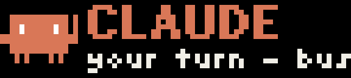
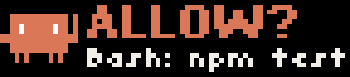
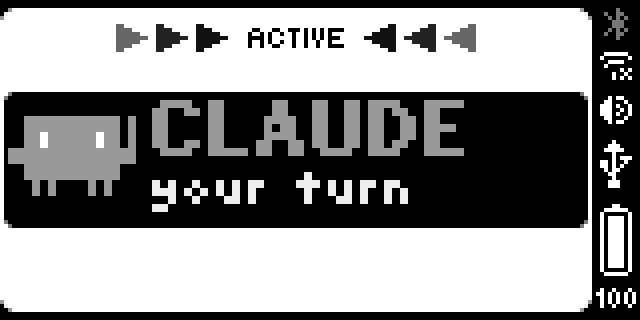

<p align="center">
  
</p>

<h1 align="center">busybar-agents</h1>

<p align="center">
  Coding agents raise a hand on your <a href="https://busy.app">BUSY Bar</a> when they need you.
</p>

<p align="center">
  <a href="https://github.com/davidkh1/busybar-agents/actions/workflows/ci.yml"></a>
  
  
  
</p>

Claude Code needs you: the mascot raises an arm and the LEDs blink. You
reply, the arm drops. The turn ends, it smiles. Turn the wheel to approve
a tool call. A chime is optional.

| | |
| --- | --- |
|  | **Done.** The turn ended. |
|  | **Ask.** Wheel forward allows, back denies. |
|  | **Two sessions.** One strip, one queue. |
|  | **Your side.** The back OLED mirrors the front. |

## Setup

Plug the bar in over USB, then inside Claude Code:

```
/plugin marketplace add davidkh1/busybar-agents
/plugin install busybar-agents@busybar-agents
```

Needs [uv](https://docs.astral.sh/uv/) on your PATH; the plugin runs its
command line through `uvx`, fetched once. Linux and macOS. That is all;
everything below is optional.

<details>
<summary>From a clone instead</summary>

```bash
git clone https://github.com/davidkh1/busybar-agents
ln -s "$PWD/busybar-agents/adapters/claude-code" ~/.claude/skills/busybar-agents
```

The hook then finds the command line in the clone, so edits take effect at
once. Loading a plugin from the skills folder is undocumented; it works
today. Do not combine it with the plugin install or every hook runs twice.

</details>

The hand goes up when Claude needs permission, waits for you, needs input,
or auto mode blocks a call. It comes down when you type. Every turn ends
with DONE. The name after the reason is the session's `/rename` title, or
the folder, and `/color pink` turns that session's mascot and LEDs pink.

## The wheel

The bar has a wheel on its side. Two switches let you answer Claude with it
instead of the keyboard:

```bash
BUSYBAR_ASK=1 BUSYBAR_GO=1 claude
```

Export them in your shell profile and the command stays plain `claude`, or
flip both from inside a session with `/busybar-agents:wheel on` (`off`,
`status`). That setting is remembered for every session on this machine; a
variable in the environment wins over it.

| Claude asks | Top line, bottom line | You |
| --- | --- | --- |
| permission for a tool call (`ASK`) | `ALLOW?`, `Bash: npm test` | wheel forward allows, back denies |
| a multiple-choice question (`ASK`) | `React`, `1/3 Framework` | scroll to an option, stay on it for 2.5 s |
| "shall I…?" at the end of a turn (`GO`) | `GO?`, `wheel = yes` | forward means go ahead |

Ignore the bar and the terminal asks you instead, after 20 seconds
(`BUSYBAR_ASK_TIMEOUT`).

## Codex CLI

```bash
python3 busybar-agents/adapters/codex/install.py   # merges into ~/.codex/hooks.json
codex                                               # then /hooks, trust them
```

Same hands, same wheel, same `busybar-agents wheel on` switch. `install.py
--uninstall` removes them.

## Settings

| Variable | Default | Meaning |
| --- | --- | --- |
| `BUSYBAR_ADDR` | `10.0.4.20` | The bar's fixed USB address, or its Wi-Fi address |
| `BUSYBAR_TOKEN` | unset | Access key, Wi-Fi only |
| `BUSYBAR_PRIORITY` | `50` | `91` or more draws over a running focus session, which otherwise outranks the plugin |
| `BUSYBAR_SOUND` | off | `1` plays the bar's reminder chime when a hand goes up; or a stock sound name (`event`, `reminder`) |
| `BUSYBAR_ASK` | off | `1`: permissions and questions on the wheel |
| `BUSYBAR_GO` | off | `1`: go ahead on the wheel after a question |

<details>
<summary>More settings</summary>

| Variable | Default | Meaning |
| --- | --- | --- |
| `BUSYBAR_TTL` | `1800` | Seconds a hand may stay up |
| `BUSYBAR_DONE_SECONDS` | `8` | How long DONE stays |
| `BUSYBAR_HELLO_SECONDS` | `4` | Ready blip at session start, `0` disables |
| `BUSYBAR_ASK_TIMEOUT` | `20` | Seconds to wait for the wheel |
| `BUSYBAR_GO_SECONDS` | `8` | How long GO? stays |
| `BUSYBAR_DRY_RUN` | off | `1` prints payloads instead of drawing |
| `BUSYBAR_STATE` | platform default | Hands file: `~/.local/state/busybar-agents/hands.json` on Linux, `~/Library/Application Support/busybar-agents/hands.json` on macOS |
| `BUSYBAR_AGENTS_BIN` | unset | CLI command for the hook bridges |

</details>

<details>
<summary>Command line and internals</summary>

```bash
busybar-agents raise  --agent claude --session 1a2b3c4d --project api --reason "permission?"
busybar-agents lower  --agent claude --session 1a2b3c4d
busybar-agents done   --agent claude --session 1a2b3c4d --project api
busybar-agents ask    --question "ALLOW?" --detail "Bash: npm test"   # allow, deny or timeout
busybar-agents choose --title Framework --option React --option Vue    # the label, cancel or timeout
busybar-agents wheel  on | off | status                                 # what /busybar-agents:wheel runs
busybar-agents hello | status | redraw | clear
```

Each adapter is one standard-library script that turns hook events into
these verbs. Hands are recorded in one JSON file, one per agent and
session, and the strip is redrawn from the whole list, so several sessions
share it. Everything is filed under the application name `busybar-agents`
and carries a timeout; icons are inline bitmaps, sounds are stock, nothing
is uploaded to the bar.

```bash
uv sync && uv run pytest          # no hardware needed
claude plugin validate .          # the marketplace and the plugin
```

The installed plugin is a copy of `adapters/claude-code` alone, so its hook
runs the command line with `uvx` pinned to the commit named in `hook.py`.
Bump that pin when the CLI changes.

</details>

## Credits

Built on [busylib](https://github.com/busy-app/busylib-py), Flipper Devices'
MIT-licensed Python client, and the bar's
[HTTP API](https://docs.busy.app/bar/dev/http-api). The mascot belongs to
Claude Code. Not affiliated with Flipper Devices or Anthropic.

MIT. Images in `img/` are CC BY 4.0.
