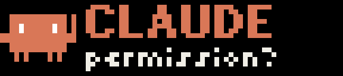
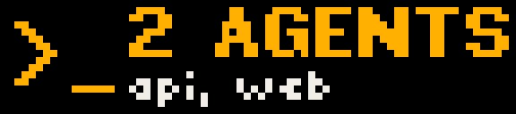

# busybar-agents

Coding agents raise a hand on your [BUSY Bar](https://busy.app) when they need you.



Claude Code asks for permission, or sits idle waiting for your answer, and the
bar on your desk shows a pair of eyes, who is asking, which project, and why.
Its status LEDs blink. You type a reply and the hand goes down. The turn ends
and a green check shows for a few seconds. Turn the wheel, and the tool call
is approved or denied without touching the keyboard.

This started with [a post by Caitlin Kalinowski](https://x.com/kalinowski007/status/2096446783883001945)
asking for "a little minibot that does something cute when my AI agents need my
attention". The BUSY Bar is already on the desk: a 72x16 LED strip facing the
room, an OLED facing you, two RGB status LEDs, a speaker, physical buttons,
and an open HTTP API over USB. This project is the small piece in between.

## What happens on the bar

| Moment | Strip |
| --- | --- |
| A session starts | Clawd, `CLAUDE`, `ready`, four seconds |
| Claude asks for permission, waits idle, or a subagent needs input | Clawd with an arm up, `CLAUDE`, `permission?` / `your turn` / `input?` |
| You type a reply, or the session ends | cleared |
| A turn finishes | happy Clawd, `DONE`, `project`, eight seconds |
| A tool call needs a decision (opt-in) | Clawd with an arm up, `ALLOW?`, `Bash: npm test` |
| Two or more agents are waiting | `2 AGENTS`, `api, web` |

Claude's screens use Claude's orange and Clawd, the Claude Code mascot, as a
16-pixel bitmap drawn inline. The status LEDs blink in the same colour. Other
agents get a `>_` glyph in their own colour.




The back OLED mirrors the same notification, so you see it from your side too.

## Requirements

- A BUSY Bar on firmware 1.2 or later, plugged in over USB. It answers at
  `10.0.4.20` with no setup. Wi-Fi works too once HTTP access is enabled in the
  bar's web UI; then set the address and access key below.
- Linux or macOS. Python 3.10 or newer for the CLI; [uv](https://docs.astral.sh/uv/) makes the install a one-liner.
- For the Claude Code adapter: Claude Code 2.1 or newer.

## Linux and macOS

Both work the same way. The bar appears as a USB network interface on either
system without drivers, and answers at `10.0.4.20`. The hook bridge runs on
the system `python3`, including the 3.9 that Apple's developer tools ship,
while the CLI runs under uv with its own Python 3.10 or newer. CI runs the
tests on Ubuntu and macOS. Windows is untested.

## Install

```bash
uv tool install git+https://github.com/davidkh1/busybar-agents
busybar-agents status
```

`status` lists raised hands and confirms the bar answers. Without `uv`,
`pipx install git+https://github.com/davidkh1/busybar-agents` does the same.

## Claude Code

The adapter is a Claude Code plugin. Clone the repo and load it for a session:

```bash
git clone https://github.com/davidkh1/busybar-agents
claude --plugin-dir ./busybar-agents/adapters/claude-code
```

If `busybar-agents` is not on your PATH, the plugin runs it from the cloned
repo through `uv run`, so cloning is enough. To load it in every session
without the flag, add it to your settings as a plugin or copy the `hooks`
object from `adapters/claude-code/hooks/hooks.json` into `~/.claude/settings.json`.

| Claude Code event | What the bar does |
| --- | --- |
| `SessionStart` on startup or resume | ready blip |
| `Notification` with `permission_prompt`, `idle_prompt`, `agent_needs_input`, `elicitation_dialog` | hand up |
| `UserPromptSubmit`, `SessionEnd` | hand down |
| `Stop` | done |
| `PermissionRequest`, only with `BUSYBAR_ASK=1` | ask, then answer Claude Code |

The hand-up and hand-down hooks run in the background. `Stop` and
`SessionEnd` run in the foreground because Claude Code exits right after them
in print mode and would skip a background hook; each takes about a quarter of
a second.

### Answering from the bar

```bash
BUSYBAR_ASK=1 claude --plugin-dir ./busybar-agents/adapters/claude-code
```

When a tool call needs your permission, the bar shows `ALLOW?` and what the
tool is about to do. Turn the wheel forward to allow, backward or press Back
to deny. If you do nothing for `BUSYBAR_ASK_TIMEOUT` seconds, the usual prompt
appears in the terminal.

Two things to know. The terminal prompt waits for that timeout, so keep it
short. And the bar's own UI still sees the gesture: the wheel only moves a
highlight on the idle screen, which is why it is the wheel and not the Start
button, but inside a bar menu it scrolls that menu.


## The command line

Every adapter ends up calling these, and so can any script or cron job:

```bash
busybar-agents raise --agent claude --session 1a2b3c4d --project api --reason "needs permission"
busybar-agents lower --agent claude --session 1a2b3c4d
busybar-agents done  --agent claude --session 1a2b3c4d --project api
busybar-agents ask   --question "ALLOW?" --detail "Bash: npm test"    # prints allow, deny or timeout
busybar-agents hello --agent claude --project api                  # four-second ready blip
busybar-agents status
busybar-agents clear
```

One hand per `agent` and `session` pair. Raising the same pair again replaces
it; several pairs share the strip. Hands older than `BUSYBAR_TTL` are dropped,
so a session that died without lowering its hand does not stay up all day.

## Configuration

Everything is an environment variable, so the same settings apply from a
shell, a Claude Code hook, or any other adapter.

| Variable | Default | Meaning |
| --- | --- | --- |
| `BUSYBAR_ADDR` | `10.0.4.20` | The bar's address. USB is `10.0.4.20`; over Wi-Fi use its LAN address. |
| `BUSYBAR_TOKEN` | unset | Access key, needed over Wi-Fi only. |
| `BUSYBAR_PRIORITY` | `50` | Draw priority. `91` or more shows even over a running BUSY session. |
| `BUSYBAR_SOUND` | off | `1` for the stock `reminder` chime on hand up, or any stock sound name. |
| `BUSYBAR_TTL` | `1800` | Seconds a hand stays up if nobody lowers it. |
| `BUSYBAR_DONE_SECONDS` | `8` | How long DONE stays. |
| `BUSYBAR_HELLO_SECONDS` | `4` | Length of the ready blip at session start. `0` turns it off. |
| `BUSYBAR_ASK_TIMEOUT` | `20` | Seconds to wait for the wheel before falling back to the terminal. |
| `BUSYBAR_ASK` | off | `1` lets the Claude Code adapter answer permission prompts from the bar. |
| `BUSYBAR_DRY_RUN` | off | `1` prints the payloads instead of drawing. |
| `BUSYBAR_STATE` | `~/.local/state/busybar-agents/hands.json` on Linux, `~/Library/Application Support/busybar-agents/hands.json` on macOS | Where raised hands are recorded. |
| `BUSYBAR_AGENTS_BIN` | unset | Explicit command for the CLI, for the hook bridge. |

## How it works

```
Claude Code hook ──▶ adapters/claude-code/hook.py ──▶ busybar-agents CLI ──▶ busylib ──▶ HTTP API ──▶ bar
Codex / Gemini hook ─┘ (adapters to come)                 │
MCP server (to come) ─────────────────────────────────────┘
```

The CLI records hands in a small JSON file and redraws the strip from the
whole list, so agents from different vendors never fight over the display.
Everything it draws or plays is filed under the application name
`busybar-agents` on the bar, so `busybar-agents clear` removes only its own
work and leaves the bar's timers and other apps alone. Drawings carry a
timeout, so an unplugged laptop never leaves a hand up forever.

Icons are inline bitmaps and sounds are stock; nothing is uploaded to the bar.

## Roadmap

- Codex CLI adapter, through its hooks.
- Gemini CLI adapter, through its `Notification` and `AfterAgent` hooks.
- An MCP server exposing `raise_hand` and `ask_user`, for agents without hooks.
- A waving Clawd, using the bar's animation element.

## Development

```bash
git clone https://github.com/davidkh1/busybar-agents
cd busybar-agents
uv sync
uv run pytest
BUSYBAR_DRY_RUN=1 uv run busybar-agents raise --agent claude --reason "needs permission"
claude plugin validate ./adapters/claude-code
```

The tests need no hardware. With a bar plugged in, `uv run busybar-agents status` is the smoke test.

## Credits

Built on [busylib](https://github.com/busy-app/busylib-py), Flipper Devices'
MIT-licensed Python client for the bar, and on the bar's
[open HTTP API](https://docs.busy.app/bar/dev/http-api). Not affiliated with
Flipper Devices or Anthropic.

## License

MIT. Images in `docs/` are CC BY 4.0.
